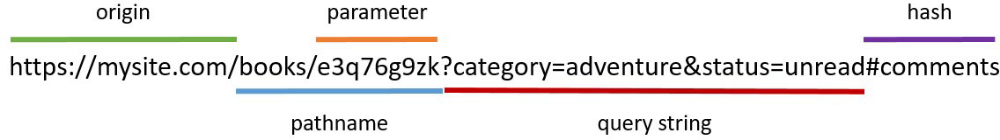

# React + Vite

# actions.js - файл оголошення екшенів програми

# reducer.js - файл оголошення функцій-редюсерів для оновлення стану

# constants.js - файл для зберігання констант (наприклад, значень фільтру статусу)

# selectors.js - файл оголошення функцій-селекторів

# store.js - файл створення стор Redux
